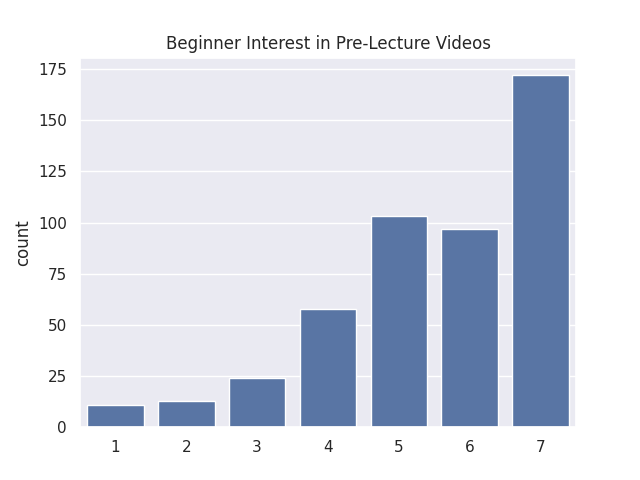
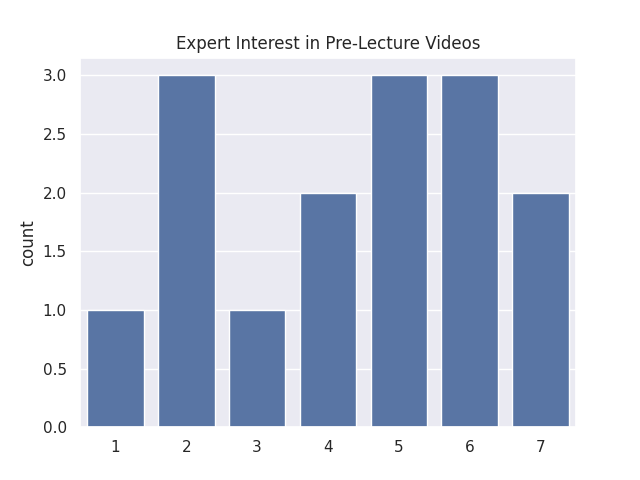
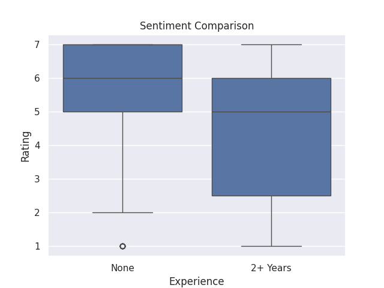

---
# Do not edit the text between these lines!
layout: default
---

# MY COMP110 Data Analysis Project
**By Jackson Krupinski**

## Project Overview and Summary
In this project, I explored how different course components contribute to student learning in COMP110 in order to identify opportunities for continuous improvement. Specifically, I focused on whether certain instructional resources, such as lesson videos, programming assignments, and office hours, are perceived as more effective than others. The goal of this analysis is to identify which parts of the course create the most value for students and where adjustments could improve the learning experience. I chose this idea because students are the primary stakeholders in COMP110, and improving how effectively they learn directly increases the course’s value. The survey dataset provides multiple variables related to perceived effectiveness, making it possible to compare different learning tools. By analyzing these responses, I aimed to determine which course elements are most impactful and whether any are underutilized or could be improved.

## Data Analysis and Visualizations

**Chart 1: Beginner interest in Pre-lecture videos (Ratings 1-7)** 

**Chart 2: Expert interest in Pre-Lecture videos (Ratings 1-7)** 

**Chart 3: Sentiment comparison based on experience** 

## Conclusion
My analysis of the survey data strongly supports the implementation of pre-lecture videos. By using the select and count functions, I found that a significant majority of students who reported low experience also expressed a high need for pre lecture videos. This suggests that targeting this specific area would create substantial value for students by reducing course friction. The main downside to this proposal is the additional time required from the instructional staff to develop these resources. However, the data suggests this upfront cost would lead to fewer office hour visits later in the semester. To refine this idea, I would like to collect data on whether these interventions actually improve quiz scores or if the perceived "helpfulness" doesn't translate to performance.

<!-- This is a comment. Below, you'll see code for inserting an image. To make this image appear, update <custom-path>. To add an image, save it inside the imgs folder of this repository. -->
[Comp110 Logo](static/imgs/logo.png)

